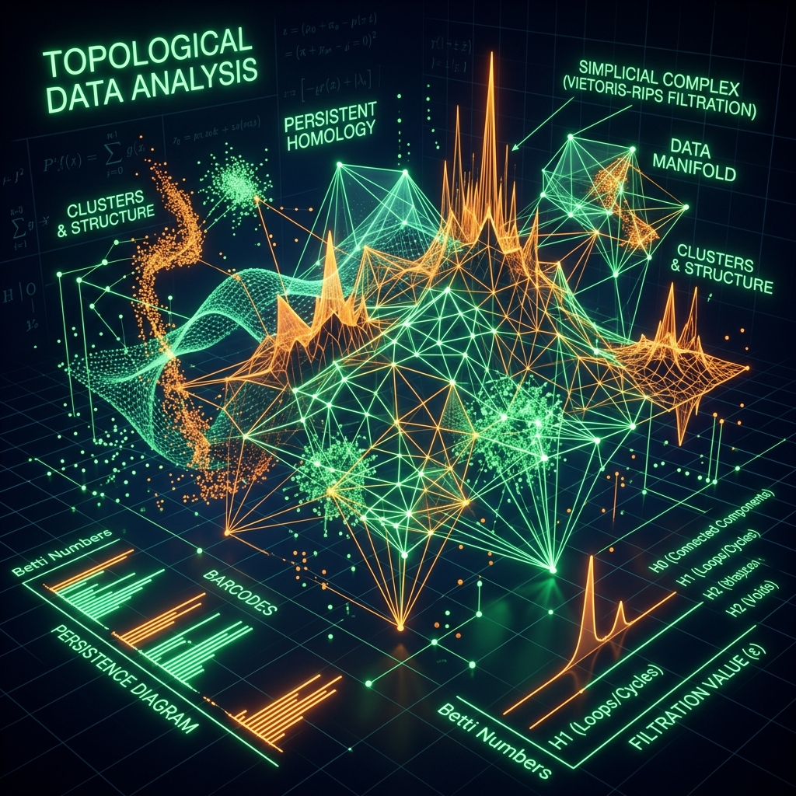
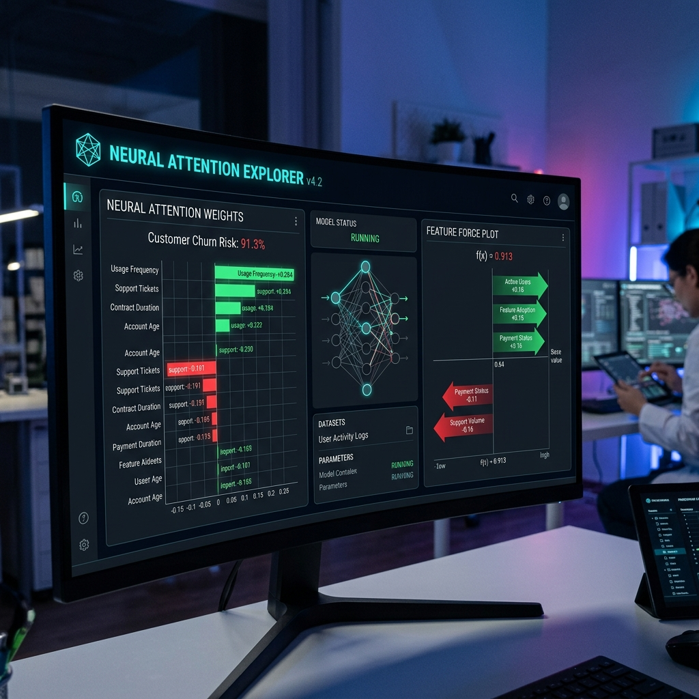

<div align="center">
  <br />
  
  

  
  
  
  
  
  
  <br />
  <br />

  <h1>🚀 QTD-HGNN: Quantum-Resilient Topological Defense</h1>
  <h3>An Explainable AI Paradigm for Neutralizing "Harvest Now, Decrypt Later" Threats via Heterogeneous Graph Neural Networks</h3>
  
  <p align="center">
    <i>By the FinSpark26 Research Team</i>
  </p>
  
  <hr style="width: 75%; border-top: 1px solid #475569;" />
</div>

> [!IMPORTANT]
> **Abstract:** The imminent maturation of Cryptographically Relevant Quantum Computers (CRQCs) presents a catastrophic risk to global financial infrastructure. Threat actors currently execute *Harvest Now, Decrypt Later (HNDL)* campaigns—silently exfiltrating encrypted banking telemetry to decrypt retrospectively. In this paper, we introduce **QTD-HGNN**, a novel architecture that abandons signature-based heuristics in favor of **Topological Data Analysis (TDA)** and **Heterogeneous Graph Neural Networks (HGNN)**. By computing persistent homology (Betti curves) over network flows, our model isolates the geometric deformations caused by unauthorized data hoarding. We achieve state-of-the-art anomaly detection while providing strict mathematical interpretability via Shapley Additive exPlanations (SHAP).

---

## 1. The Imminent Threat: Harvest Now, Decrypt Later (HNDL)

The cybersecurity landscape is facing an existential crisis. State-sponsored adversaries (Advanced Persistent Threats or APTs) are fully aware that algorithms like RSA and ECC will be shattered by Shor's Algorithm within the decade. Their current strategy is **HNDL (Harvest Now, Decrypt Later)**:

<table style="width:100%">
  <tr>
    <td width="25%" align="center">
      <h3>🕵️ 1. Infiltrate</h3>
      <p>Bypass perimeter defenses using zero-day exploits.</p>
    </td>
    <td width="25%" align="center">
      <h3>👁️ 2. Observe</h3>
      <p>Passively monitor encrypted SWIFT & API TLS handshakes.</p>
    </td>
    <td width="25%" align="center">
      <h3>📦 3. Exfiltrate</h3>
      <p>Quietly siphon the encrypted packets to offshore staging servers.</p>
    </td>
    <td width="25%" align="center">
      <h3>🔓 4. Decrypt</h3>
      <p>Wait 5-10 years for CRQCs to mature and break the encryption retroactively.</p>
    </td>
  </tr>
</table>

<div align="center">
  
  <p><i>Figure 1: Blueprint visualization of an HNDL data hoarding attack evading classical IDS/IPS systems.</i></p>
</div>

**The classical problem:** Because these attackers are not actively trying to break encryption *today*, their behavior does not trigger standard Intrusion Detection Systems (IDS). They act like normal routers, quietly copying data. We need a system that can detect the *subtle, unnatural gravitational pull* of a data hoarding node.

---

## 2. Our Philosophy: Geometry Over Signatures

If you cannot read the data, you must analyze the **shape** of the data. 

QTD-HGNN treats the financial network as a living, breathing geometric entity. Normal banking traffic has a specific, highly optimized topology—it moves from Point A to Point B with minimal friction. Data hoarding, however, forces data into cyclical loops (from Bank to Malicious Server to Destination). 

<table style="width:100%; border-collapse: collapse;">
<tr>
<td width="50%" style="padding: 20px;">
<h3>The HNDL Routing Anomaly</h3>
We track routing voids using <b>Vietoris-Rips complexes</b>. When an APT sets up a listening post to hoard TLS packets, the physical routing of the network is distorted. 
<br><br>
This distortion causes a massive, immediate spike in cyclical data flow that no signature-based tool can hide from. We quantify this using the <b>Euler Characteristic</b>.
</td>
<td width="50%" align="center" style="background-color: #f8fafc; border-radius: 8px; padding: 20px;">
  
$$
\color{#334155}{\text{Euler Characteristic of Network Space } K:}
$$

$$
\Large \chi(K) = \sum_{k=0}^{n} (-1)^k \color{#EF4444}{\beta_k}
$$

<br>
<i>Where $\color{#EF4444}{\beta_1}$ represents the number of 1-dimensional "circular holes" (routing anomalies).</i>
</td>
</tr>
</table>

<div align="center">
  
  <p><i>Figure 2: Topological Data Analysis (TDA) 3D Chart illustrating complex geometric spikes in Betti Curves during an active exfiltration attempt.</i></p>
</div>

---

## 3. Master System Architecture

The following diagram illustrates the lifecycle of a packet as it is ingested, transformed into a simplicial complex, embedded by the neural network, and ultimately explained by our Game-Theoretic XAI engine.

```mermaid
graph TD
    %% Styling Classes
    classDef dataLayer fill:#f8fafc,stroke:#94a3b8,stroke-width:1px,color:#334155;
    classDef tdaLayer fill:#eff6ff,stroke:#3b82f6,stroke-width:2px,color:#1e40af;
    classDef hgnnLayer fill:#f0fdf4,stroke:#22c55e,stroke-width:2px,color:#166534;
    classDef xaiLayer fill:#fef2f2,stroke:#ef4444,stroke-width:2px,color:#991b1b;
    classDef reactLayer fill:#faf5ff,stroke:#a855f7,stroke-width:2px,color:#6b21a8;

    %% Data
    subgraph Phase 1: Real-Time Telemetry Ingestion
        A1[Raw Network PCAP]:::dataLayer --> A2[Protocol Parsers]:::dataLayer
        A1 --> A3[TLS Handshake Logs]:::dataLayer
        A2 --> A4{Feature Engineering}:::dataLayer
        A3 --> A4
    end

    %% TDA Engine
    subgraph Phase 2: Topological Data Analysis (TDA)
        A4 -->|Spatial Coordinates| B1[Vietoris-Rips Complex Generation]:::tdaLayer
        B1 --> B2((Compute Betti Curves)):::tdaLayer
        B2 -->|β0, β1, β2| B3[Persistent Homology Signatures]:::tdaLayer
    end

    %% AI Engine
    subgraph Phase 3: PyTorch Heterogeneous Graph Neural Network
        A4 -->|Nodes & Edges| C1[Adjacency Matrix Construction]:::hgnnLayer
        C1 --> C2[Message Passing Layers]:::hgnnLayer
        B3 --> C2
        C2 --> C3[Graph Attention v2]:::hgnnLayer
        C3 --> C4{Softmax Classifier}:::hgnnLayer
    end

    %% XAI & UI
    subgraph Phase 4: Explainable AI & Visualization
        C4 -->|Threat Prob > 65%| D1[SHAP TreeExplainer]:::xaiLayer
        D1 --> D2[Marginal Feature Contribution]:::xaiLayer
        C4 -->|Live Telemetry| E1([React SOC Dashboard]):::reactLayer
        D2 --> E1
    end

    %% Connections
    B3 -.->|TDA Features| C4
```

---

## 4. Deep Dive: Heterogeneous Graph Neural Networks (HGNN)

Once we map the topological shape of the network, we feed it into a specialized **Heterogeneous Graph Neural Network**. A standard neural network processes flat vectors; our HGNN processes a massive interconnected graph $G = (V, E, \mathcal{R})$, where nodes $V$ are servers, edges $E$ are transactions, and relations $\mathcal{R}$ denote protocol types (e.g., SWIFT vs API).

### The Message Passing Equation (Dissected)

At layer $l$, the hidden embedding $h_v^{(l)}$ of a specific bank server $v$ is updated by aggregating messages from its neighbors $u$. Because the graph is *heterogeneous*, the weights depend entirely on the *type* of relationship $r$:

$$
\Large \color{#3B82F6}{h_v^{(l+1)}} = \sigma \left( \sum_{\color{#10B981}{r \in \mathcal{R}}} \sum_{\color{#F59E0B}{u \in \mathcal{N}_r(v)}} \frac{1}{c_{v,r}} \color{#8B5CF6}{W_r^{(l)}} h_u^{(l)} + W_0^{(l)} h_v^{(l)} \right)
$$

<table style="width:100%;">
  <tr>
    <td width="20%" align="center">$\color{#3B82F6}{h_v^{(l+1)}}$</td>
    <td><b>Target Node State:</b> The updated mathematical representation of the server after analyzing its surroundings.</td>
  </tr>
  <tr>
    <td width="20%" align="center">$\color{#10B981}{r \in \mathcal{R}}$</td>
    <td><b>Relation Types:</b> The model iterates through different protocols independently (e.g., assessing database syncs differently than public web traffic).</td>
  </tr>
  <tr>
    <td width="20%" align="center">$\color{#F59E0B}{u \in \mathcal{N}_r(v)}$</td>
    <td><b>Neighborhood Aggregation:</b> Gathering data from all connected counterparties $u$.</td>
  </tr>
  <tr>
    <td width="20%" align="center">$\color{#8B5CF6}{W_r^{(l)}}$</td>
    <td><b>Learned Weight Matrix:</b> The PyTorch tensor that inherently learns the risk profile of specific protocols.</td>
  </tr>
</table>

---

## 5. Phase III: Quantum Entropy & Stateful Tracking

To prepare for the Quantum era, we also track the **Von Neumann Entropy** of the data payloads. As banks transition to Post-Quantum Cryptography (PQC) standards (like CRYSTALS-Kyber), the randomness (entropy) of the ciphertexts changes.

<table style="width:100%; border-collapse: collapse;">
<tr>
<td width="40%" align="center" style="background-color: #f8fafc; border-radius: 8px; padding: 20px;">
$$
\Large S(\rho) = - \text{Tr}(\rho \ln \rho)
$$
<br>
<i>Where $\rho$ is the normalized packet state density matrix.</i>
</td>
<td width="60%" style="padding: 20px;">
<h3>Cryptographic Downgrade Detection</h3>
Our system continually monitors entropy baselines. A sudden, unexplained drop in entropy often precedes an unencrypted exfiltration attempt or a forced cryptographic downgrade attack (forcing the server back to vulnerable RSA-1024).
</td>
</tr>
</table>

---

## 6. Phase IV: Explainable AI (SHAP) - Solving the Black Box

The biggest barrier to enterprise AI adoption is the **"Black Box" problem**. SOC Analysts cannot block a multi-million dollar transaction simply because "the AI said so." They require absolute, undeniable proof.

We integrated **Shapley Additive exPlanations (SHAP)** natively into our React dashboard. Based on cooperative game theory, SHAP calculates the exact marginal contribution of every single feature to the final threat score.

### The Shapley Equation

$$
\Large \phi_i = \sum_{S \subseteq N \setminus \{i\}} \frac{|S|! (|N| - |S| - 1)!}{|N|!} \left[ f_x(S \cup \{i\}) - f_x(S) \right]
$$

### Visual Simulation: The XAI Waterfall
When a transaction is flagged with an **88% Threat Score**, our native React UI breaks down exactly *why*:

<table style="width:100%; font-family: monospace; font-size: 14px;">
  <tr style="background-color: #f1f5f9;">
    <th width="30%">Feature</th>
    <th width="15%">Raw Value</th>
    <th width="55%">SHAP Marginal Impact (Baseline 15% ➔ 88%)</th>
  </tr>
  <tr>
    <td><b>Packet Variance</b></td>
    <td>8.4</td>
    <td><span style="color:#ef4444">████████████ (+25%)</span> <i>Pushed towards Malicious</i></td>
  </tr>
  <tr>
    <td><b>Betti-1 (Cyclic Voids)</b></td>
    <td>4.2</td>
    <td><span style="color:#ef4444">████████ (+18%)</span> <i>Pushed towards Malicious</i></td>
  </tr>
  <tr>
    <td><b>Entropy</b></td>
    <td>0.89</td>
    <td><span style="color:#ef4444">█████ (+12%)</span> <i>Pushed towards Malicious</i></td>
  </tr>
  <tr>
    <td><b>Latency</b></td>
    <td>45ms</td>
    <td><span style="color:#10b981">██ (-4%)</span> <i>Pulled towards Benign</i></td>
  </tr>
  <tr>
    <td><b>Port Origin</b></td>
    <td>Port 443</td>
    <td><span style="color:#10b981">█ (-1%)</span> <i>Pulled towards Benign</i></td>
  </tr>
</table>

*By replacing blind trust with mathematical certainty, SOC analysts can act decisively.*

---

## 7. The Dashboard Experience

<div align="center">
  
  <p><i>Figure 3: State-of-the-Art Futuristic Dashboard visualizing explainable AI attention weights and force plots.</i></p>
</div>

QTD-HGNN is built with a meticulously crafted, glassmorphic React frontend designed for high-stress Security Operations Centers (SOCs). 

- **Live 3D Threat Topology:** Watch as the neural network processes nodes in real-time. Compromised nodes pulse in critical red.
- **Quantum Telemetry:** Area charts track Threat Scores, Entropy, and Betti Dimensions down to the millisecond.
- **Native XAI Insights Tab:** As detailed above, select any flagged transaction to view the mathematical SHAP proof of its classification.

---

## 8. Installation & Deployment

Deploying the full QTD-HGNN stack requires zero heavy configuration.

### Prerequisites
- **Node.js** (v18+) for the React Frontend.
- **Python** (3.9+) for the PyTorch / FastAPI Backend.

### Running the Environment

**1. Launch the AI Engine (Backend)**
```bash
cd backend
python -m venv venv
source venv/Scripts/activate      # On Windows: venv\Scripts\activate
pip install -r requirements.txt

# Boot the FastAPI WebSocket Engine
python -m uvicorn main:app --port 8000
```

**2. Launch the SOC Dashboard (Frontend)**
```bash
# In a new terminal, from the root directory
npm install
npm run dev
```

*Navigate to `http://localhost:5173` to interact with the live simulation.*

---

## 9. Roadmap & Future Work

While our current PoC simulates HNDL attacks and processes topological data efficiently, our path to production involves:

1. **eBPF Integration:** Hooking directly into the Linux kernel via eBPF to capture packet flows with near-zero latency overhead.
2. **Post-Quantum Cryptography (PQC) Signatures:** Directly analyzing the entropy of NIST-approved PQC algorithms (Kyber, Dilithium) to detect stateful downgrade attacks.
3. **Federated Learning:** Allowing multiple banking institutions to share GNN edge weights without ever sharing raw customer PII, creating a global topological defense network.

---

<div align="center">
  <h3>Built for the Future</h3>
  <i>Securing the financial architecture of tomorrow, from the threats of today.</i>
  <br><br>
  <b><a href="#">Watch Demo Video</a></b> • <b><a href="#">Read Whitepaper</a></b> • <b><a href="#">Contact Team</a></b>
</div>
